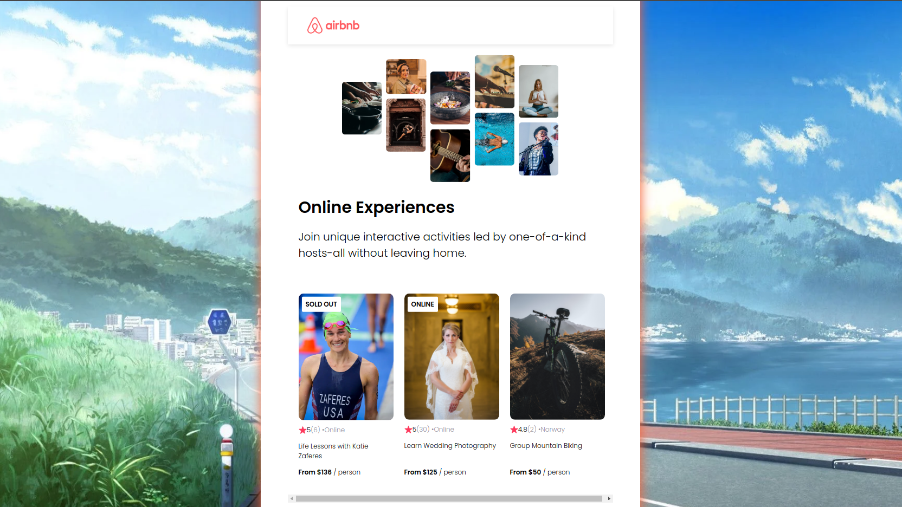

# Airbnb Experiences Clone
You'll take your React skills to the next level by creating an Airbnb Experiences clone.

## Table of contents
- [Introduction](#introduction)
- [Overview](#overview)
  - [Screenshot](#screenshot)
  - [Built using](#built-using)
  - [Lessons Learned](#lessons-learned)
- [Author](#author)
- [Acknowledgement](#acknowledgement)

## Introduction
- This is my solution to the second part of [Learn React](https://scrimba.com/learn/learnreact).
- This webpage was setup using [Vite](https://vitejs.dev/).
- This webpage features:
    - Reusable components
    - Mapping components

## Overview
- Link: [github.com/kierhb/airbnb-clone](https://github.com/kierhb/airbnb-clone)

### Screenshot

### Built using

- HTML5 markup
- CSS
- Vanilla JavaScript
- ReactJS

### Lessons Learned

- Setting up the React application with the use of Vite.
- Reusing components by receiving mapped props.
- Pass object as props.
- Spread object as props.

## Author

- GitHub - [@kierhb](https://github.com/kierhb)
- LinkedIn - [Kier Bobila](https://www.linkedin.com/in/kier-bobila/)

## Acknowledgement
I want to acknowledge the course instructor Bob Ziroll and to all members of Scrimba community.